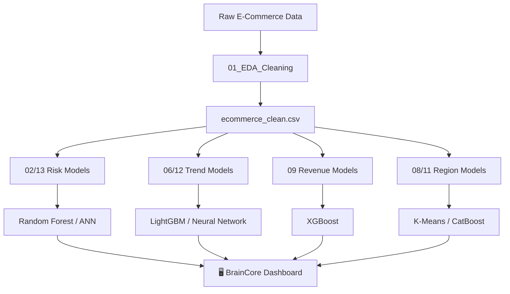

# 🧠 BrainCore — Smart E-Commerce Analytics Platform

> An end-to-end AI-powered business intelligence dashboard built with Streamlit, designed for real-time e-commerce risk detection, trend forecasting, revenue projection, and regional analysis.

---

## 📌 Project Overview

**BrainCore** is a comprehensive e-commerce analytics platform developed to help businesses identify transaction risks, predict product trends, project revenue, and analyze regional performance. This project covers the entire data science lifecycle, from data cleaning and exploratory analysis to model development and deployment into an interactive dashboard.

### 👥 Project Team
- **Machine Learning Engineers:** Choosing algorithms, preparing classification/regression models, training, and evaluation.
- **EDA Analyst / Data Analyst:** Data exploration, cleaning, feature analysis, and data preparation.
- **UI / Streamlit Developer:** Building the interactive dashboard, interface design, visualization, and model integration.

---

## 🚀 Key Features

### 📊 Platform Overview
- **Real-time KPI Metrics:** Monitor Total Transactions, Total Revenue, Trending Products, and System Health at a glance.
- **Dynamic Storytelling Analytics:** Interactive charts with titles that update based on data filters.
- **Historical Order Stream:** A detailed table of recent transactions with sortable columns.

### 🛡️ Risk Engine (Fraud & Anomaly Detection)
- **Instant Risk Assessment:** Input order parameters (Region, Category, Discount, Quantity) to get a risk score.
- **Visual Probability Bar:** Color-coded severity (🟢 Safe / 🔴 High Risk).
- **Actionable Business Advice:** Specific recommendations based on the detected risk level.

### 🔥 Trend Predictor (Market Demand Forecast)
- **Product Demand Prediction:** Forecast if a product will be **HIGH DEMAND** 🔥, **STABLE** ⚖️, or **LOW DEMAND** ❄️.
- **Trending Showcase:** View currently trending products with mini sparkline visualizations.
- **Strategic Advice:** Data-driven suggestions for inventory and marketing based on demand forecasts.

### 📈 Revenue Projections
- **Actual vs. Predicted Revenue:** Line charts comparing real performance against AI forecasts.
- **Future Forecasting:** Visual distinction between historical data and future projections.
- **Variance Analysis:** Shaded areas showing the difference between actual and predicted values.

---

## 🏗️ Project Architecture

```
yapayzeka/
│
├── 📂 Data/
│   └── Processed/
│       └── ecommerce_clean.csv          # Main cleaned dataset
│
├── 📂 Notebooks/
│   ├── 01_EDA_Cleaning.ipynb            # Data Cleaning & Exploratory Analysis
│   ├── 02_Risk_Analysis.ipynb           # Risk Detection (Random Forest)
│   ├── 03_Trending_Prediction.ipynb     # Initial Trend Prediction Exploration
│   ├── 04_Region_Analysis.ipynb         # Geographical Sales Analysis
│   ├── 05_Revenue_Prediction.ipynb      # Initial Revenue Forecasting
│   ├── 06_Trending_Prediction_LightGBM.ipynb   # ✅ Production Trend Classifier
│   ├── 07_Logistic_Regression_Risk_Analysis.ipynb # Risk Analysis Comparison
│   ├── 08_Region_Analysis_KMeans.ipynb  # Regional Segment Clustering
│   ├── 09_xgboost_revenue_prediction.ipynb # ✅ Production Revenue Regressor
│   ├── 10_Logistic_Regression_Risk_Analysis.ipynb # Advanced Risk Comparison
│   ├── 11_CatBoost_Region_Analysis.ipynb # ✅ Advanced Regional Categorization
│   ├── 12_Trending_Prediction_NeuralNetwork.ipynb # NN-based Trend Prediction
│   ├── 13_ANN_Risk_Analysis.ipynb       # ANN-based Risk Detection
│   │
│   ├── 🤖 Deployed Model Files:
│   │   ├── model_trending.pkl           # LightGBM Trend Predictor
│   │   ├── model_risiko_cerdas.pkl      # Random Forest Risk Engine
│   │   ├── model_risiko_ann.h5          # ANN Risk Model
│   │   ├── model_trending_nn.pkl        # NN Trend Model
│   │   ├── encoders.pkl                 # Categorical Label Encoders
│   │   └── X_columns.pkl                # Feature Column Metadata
│
├── 📂 src/
│   └── database.py                      # Database utilities
│
├── app.py                               # 🎯 Main Streamlit Application
├── utils.py                             # Utility functions
├── requirements.txt                     # Dependencies
└── README.md                            # Documentation
```

---

## 🤖 Machine Learning Models

| Model | Algorithm | Task | Notebook | Status |
|-------|-----------|------|----------|--------|
| **Trend Predictor** | LightGBM Classifier | Market demand forecasting | `06` | ✅ Deployed |
| **Risk Engine** | Random Forest | Fraud & anomaly detection | `02` | ✅ Deployed |
| **Revenue Forecast** | XGBoost Regressor | Future revenue projection | `09` | ✅ Trained |
| **Region Clustering** | K-Means | Sales behavior segmentation | `08` | ✅ Trained |
| **Advanced Risk** | ANN (TensorFlow) | High-precision risk detection | `13` | ✅ Trained |
| **Regional Analys.** | CatBoost | Categorizing regional performance | `11` | ✅ Trained |

### Model Pipeline



---

## 🛠️ Tech Stack

- **Language:** Python 3.11+
- **Dashboard:** Streamlit
- **ML Frameworks:** Scikit-learn, XGBoost, LightGBM, CatBoost, TensorFlow/Keras
- **Data Science:** Pandas, NumPy, Joblib
- **Visualization:** Plotly, Matplotlib, Seaborn
- **UI Components:** Custom CSS (Glassmorphism, Neon Cyan accents), `streamlit-option-menu`

---

## ⚡ Quick Start

### Installation

```bash
# 1. Clone the repository
git clone https://github.com/zakiakrom/yapayzeka.git
cd yapayzeka

# 2. Setup Virtual Environment
python -m venv .venv
.venv\Scripts\activate

# 3. Install Requirements
pip install -r requirements.txt

# 4. Launch Application
streamlit run app.py
```

### Data Pipeline
To retrain models or view analysis, run the notebooks in `Notebooks/` sequentially from `01` to `13`.

---

## 🤝 Project Members
This project was developed for the **Artificial Intelligence (Yapay Zeka)** course, Semester 6.

1. **Bilal Alfa Guldi** (22670708060)
2. **M. Thoriq Dhiya Ulhaq** (22670708061)
3. **Afif Agung Prirahmada** (23670708088)
4. **Zaki Akrom Nazih** (22670708138)

---

## 📄 License
This project is for educational and academic use only.