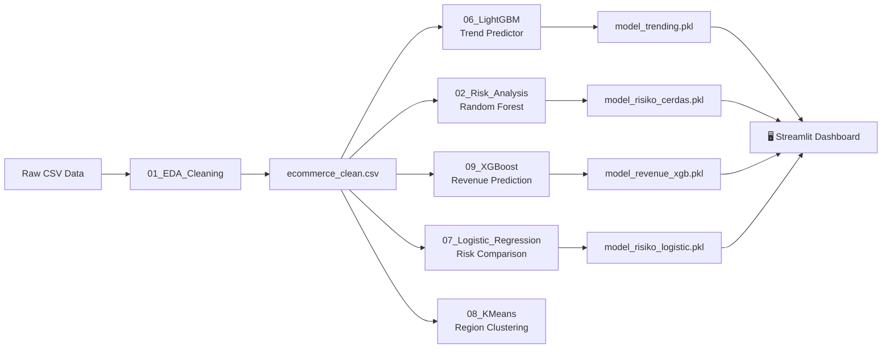

# 🧠 BrainCore — Smart E-Commerce Analytics Platform

> An end-to-end AI-powered business intelligence dashboard built with Streamlit, designed for real-time e-commerce risk detection, trend forecasting, and revenue projection.

---

## 📌 Project Overview

**BrainCore** (Sentinel AI) is a comprehensive data science project that tackles critical challenges in e-commerce operations:

1.  **Fraud & Anomaly Detection:** Identifies risky transactions in real-time using machine learning classification models.
2.  **Market Trend Forecasting:** Predicts whether a product will become a bestseller based on historical demand patterns.
3.  **Revenue Projection:** Compares actual revenue against AI-predicted values to help businesses adjust their financial strategies.
4.  **Regional Sales Mapping:** Analyzes and clusters sales performance by geographic region to optimize inventory and logistics.

The project follows the complete ML pipeline — from raw data cleaning to model training, evaluation, and finally deployment into a production-ready interactive dashboard.

---

## 🚀 Key Features

### 📊 Platform Overview
- Real-time KPI metrics: Total Transactions, Revenue, Trending Products, and System Health.
- **Dynamic storytelling analytics** — chart titles automatically update based on filtered data (e.g., "North Region Leads Sales" changes to "East Region Leads Sales" when the filter changes).
- Interactive **date filter** with quick presets (Last 7 Days, This Month, Last 3 Months, All Time).
- Regional sales bar chart with average benchmark line.
- Top 5 revenue-generating categories visualization.
- Sortable recent order stream table.

### 🛡️ Risk Engine (Fraud Detection)
- Input order parameters (Region, Category, Discount, Quantity) and get an instant AI risk assessment.
- Visual risk probability bar with color-coded severity (🟢 Safe / 🔴 High Risk).
- Actionable business advice generated per risk level.
- Historical risky transactions table with badge indicators (CRITICAL / HIGH / SAFE).

### 🔥 Trend Predictor (Market Demand Forecast)
- Enter product details (Category, Region, Price, Cost, Quantity, Discount) and the AI predicts its market demand.
- Three-tier classification: **HIGH DEMAND** 🔥, **STABLE** ⚖️, **LOW DEMAND** ❄️.
- Currently trending products showcase with mini sparkline charts.
- Strategic business advice tailored to each prediction outcome.

### 📈 Revenue Projections
- **Actual vs. AI Predicted Revenue** line chart with variance shading.
- "Today" marker line separating historical data from future forecasts.
- Future prediction lines rendered as dashed to distinguish from actuals.
- Interactive tooltips showing prediction accuracy per month.
- Revenue Streams by Category table with performance badges.
- Dedicated **date filter** for the projection view.

---

## 🏗️ Project Architecture

```
yapayzeka/
│
├── 📂 Data/
│   └── Processed/
│       └── ecommerce_clean.csv          # Cleaned dataset (output of Notebook 01)
│
├── 📂 Notebooks/
│   ├── 01_EDA_Cleaning.ipynb            # Exploratory Data Analysis & Data Cleaning
│   ├── 02_Risk_Analysis.ipynb           # Risk Detection (Random Forest - initial)
│   ├── 03_Trending_Prediction.ipynb     # Trend Prediction (initial exploration)
│   ├── 04_Region_Analysis.ipynb         # Regional Sales Analysis (EDA)
│   ├── 05_Revenue_Prediction.ipynb      # Revenue Prediction (initial exploration)
│   ├── 06_Trending_Prediction_LightGBM.ipynb   # ✅ LightGBM Trend Classifier (deployed)
│   ├── 07_Logistic_Regression_Risk_Analysis.ipynb  # ✅ Logistic Regression + RF Comparison
│   ├── 08_Region_Analysis_KMeans.ipynb  # K-Means Clustering for Region Segmentation
│   ├── 09_xgboost_revenue_prediction.ipynb  # ✅ XGBoost Revenue Regression
│   │
│   ├── 🤖 Model Files (.pkl):
│   │   ├── model_trending.pkl           # LightGBM — Trend Predictor (deployed)
│   │   ├── model_risiko_cerdas.pkl      # Random Forest — Risk Engine (deployed)
│   │   ├── model_risiko_logistic.pkl    # Logistic Regression — Risk (comparison)
│   │   ├── model_risiko_rf_compare.pkl  # Random Forest — Risk (from NB 07)
│   │   ├── encoders.pkl                 # Label Encoders for categorical features
│   │   ├── X_columns.pkl                # Feature column names for Risk model
│   │   ├── risk_features_logistic.pkl   # Feature names for Logistic model
│   │   ├── le_category.pkl              # Category label encoder
│   │   └── le_region.pkl                # Region label encoder
│   │
├── 📂 src/
│   └── database.py                      # Database utilities (reserved)
│
├── app.py                               # 🎯 Main Streamlit Dashboard Application
├── utils.py                             # Utility functions (reserved)
├── requirements.txt                     # Python dependencies
├── README.md                            # This file
└── .gitignore
```

---

## 🤖 Machine Learning Models

| Model | Algorithm | Task | Notebook | Status |
|-------|-----------|------|----------|--------|
| **Trend Predictor** | LightGBM Classifier | Predict if a product will trend | `06_Trending_Prediction_LightGBM` | ✅ Deployed |
| **Risk Engine** | Random Forest Classifier | Detect fraudulent/risky orders | `02_Risk_Analysis` | ✅ Deployed |
| **Risk Comparison** | Logistic Regression | Compare risk detection accuracy | `07_Logistic_Regression_Risk_Analysis` | ✅ Trained |
| **Revenue Prediction** | XGBoost Regressor | Forecast future sales revenue | `09_xgboost_revenue_prediction` | ✅ Trained |
| **Region Clustering** | K-Means Clustering | Segment regions by sales behavior | `08_Region_Analysis_KMeans` | ✅ Trained |

### Model Pipeline



---

## 🛠️ Tech Stack

| Layer | Technology |
|-------|-----------|
| **Language** | Python 3.11+ |
| **Dashboard** | Streamlit |
| **Visualization** | Plotly, Matplotlib, Seaborn |
| **ML Frameworks** | Scikit-learn, XGBoost, LightGBM |
| **Data Processing** | Pandas, NumPy |
| **Model Serialization** | Joblib |
| **UI Components** | streamlit-option-menu |
| **Design Theme** | Custom CSS (Dark Mode, Glassmorphism, Neon Cyan accents) |

---

## ⚡ Quick Start

### Prerequisites
- Python 3.11 or higher
- pip package manager

### Installation

```bash
# 1. Clone the repository
git clone https://github.com/yourusername/yapayzeka.git
cd yapayzeka

# 2. Create a virtual environment (recommended)
python -m venv .venv
.venv\Scripts\activate    # Windows
# source .venv/bin/activate  # macOS/Linux

# 3. Install dependencies
pip install -r requirements.txt

# 4. Run the dashboard
streamlit run app.py
```

The dashboard will open automatically at `http://localhost:8501`.

### Running the Notebooks

To retrain the models or explore the data analysis:

```bash
# Install Jupyter if not already available
pip install notebook

# Launch Jupyter Notebook
jupyter notebook Notebooks/
```

> **Note:** Run the notebooks in numerical order (01 → 09) since later notebooks depend on outputs from earlier ones (especially the cleaned dataset from `01_EDA_Cleaning`).

---

## 📸 Dashboard Preview

The dashboard features a premium dark-themed UI with:
- **Neon Cyan** accent color (`#00f2fe`) for interactive elements
- **Glassmorphism** card containers with subtle shadows
- **Plotly** interactive charts with hover tooltips
- **Responsive** layout that adapts to screen size
- **Custom HTML/CSS** badges for status indicators

---

## 📂 Dataset

- **Source:** E-Commerce Sales Data 2024-2025
- **Records:** ~5,000+ transactions
- **Features:** Order date, Region, City, Category, Sub-category, Product name, Sales, Quantity, Discount, Payment mode, and more.
- **Preprocessing:** Handled in `01_EDA_Cleaning.ipynb` — includes missing value treatment, data type conversion, feature engineering (`profit_margin`, `revenue_per_unit`, `is_trending`), and label encoding.

---

## 🧪 Notebook Descriptions

| # | Notebook | Purpose |
|---|----------|---------|
| 01 | EDA & Cleaning | Data exploration, null handling, feature engineering, export cleaned CSV |
| 02 | Risk Analysis | Train Random Forest to classify risky transactions |
| 03 | Trending Prediction | Initial trend analysis exploration |
| 04 | Region Analysis | Visual deep-dive into regional sales patterns |
| 05 | Revenue Prediction | Initial revenue forecasting exploration |
| 06 | **LightGBM Trending** | Production model for market demand prediction |
| 07 | **Logistic Regression Risk** | Alternative risk model + accuracy comparison with RF |
| 08 | **K-Means Region** | Unsupervised clustering of regions by sales behavior |
| 09 | **XGBoost Revenue** | Production model for revenue forecasting with hyperparameter tuning |

---

## 🤝 Contributing

1. Fork the repository
2. Create a feature branch (`git checkout -b feature/new-feature`)
3. Commit your changes (`git commit -m 'Add new feature'`)
4. Push to the branch (`git push origin feature/new-feature`)
5. Open a Pull Request

---

## 📄 License

This project is developed for academic purposes as part of the **Artificial Intelligence (Yapay Zeka)** course, Semester 6.

project members:
1. Bilal Alfa Guldi (22670708060)
2. M. Thoriq Dhiya Ulhaq (22670708061)
3. Afif Agung Prirahmada (23670708088)
4. Zaki Akrom Nazih (22670708138)

---